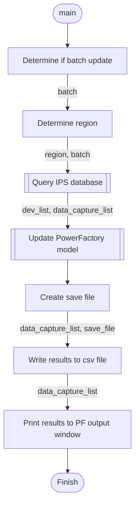

IPSProtectionDeviceSettings
===============

This script will transfer information from IPS to PowerFactory based on the plant number in the PF device name.

This script relies upon csv mapping files to get data from IPS into PowerFacroty.
The type_mapping.csv file is the key to all of the mapping. It associates the
relay attern in IPS to a relay type in PowerFactory and then the mapping csv that
maps each setting.

