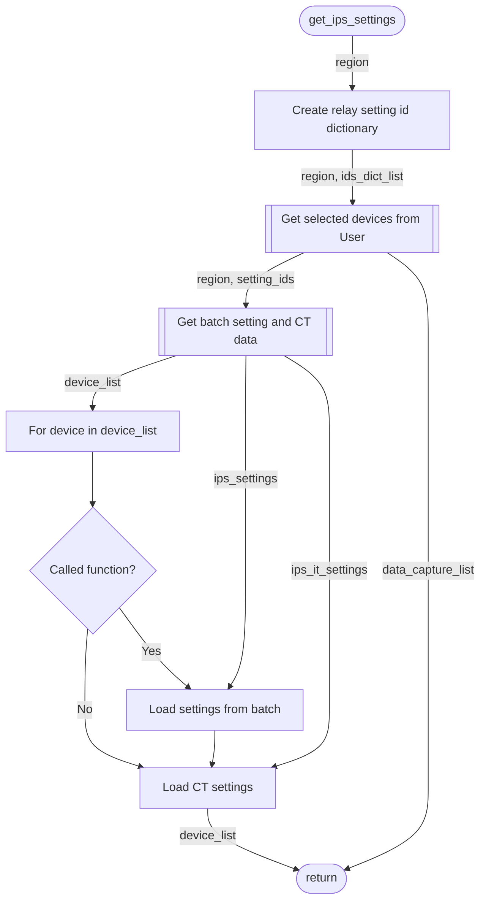
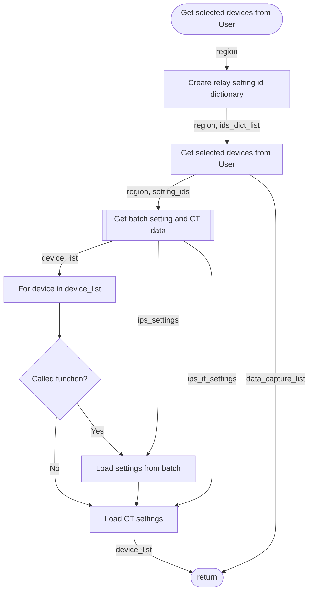

```mermaid
flowchart TD
A([get_ips_settings])-- region --> B[Create relay setting id dictionary]
B-- region, ids_dict_list --> C[[Get selected devices from User]]
C-- region, setting_ids --> D[[Get batch setting and CT data]]
D--device_list --> E[For device in device_list]
E--> F{Called function?}
F -->|No| G[Load CT settings]
F -->|Yes| H[Load settings from batch]
H --> G
G -- device_list --> I([return])
D -- ips_it_settings --> G
D -- ips_settings --> H
C -- data_capture_list --> I([return])
```

```mermaid
flowchart TD
A([Get selected devices from User])-- region --> B[Create relay setting id dictionary]
B-- region, ids_dict_list --> C[[Get selected devices from User]]
C-- region, setting_ids --> D[[Get batch setting and CT data]]
D--device_list --> E[For device in device_list]
E--> F{Called function?}
F -->|No| G[Load CT settings]
F -->|Yes| H[Load settings from batch]
H --> G
G -- device_list --> I([return])
D -- ips_it_settings --> G
D -- ips_settings --> H
C -- data_capture_list --> I([return])
```