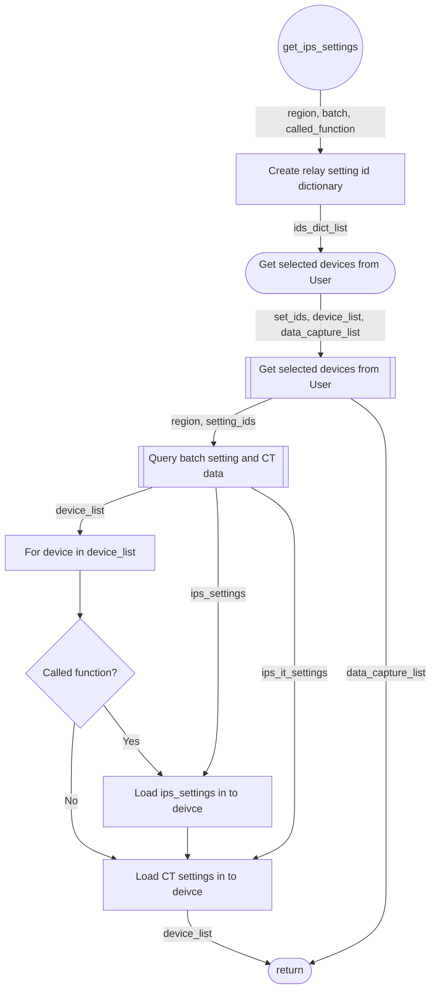
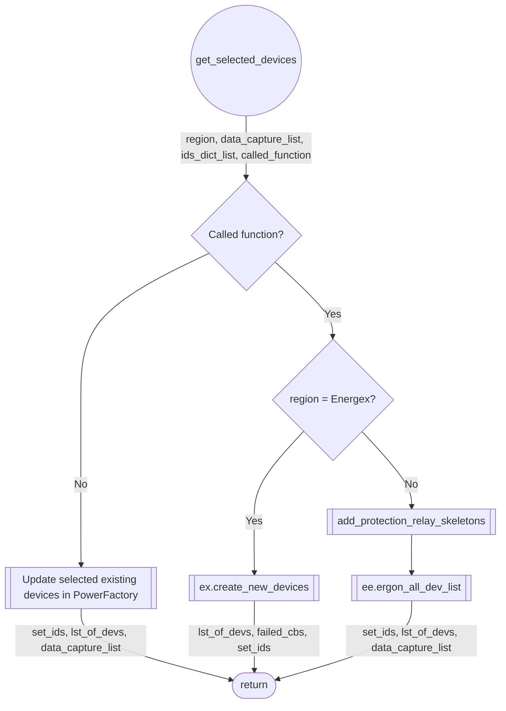
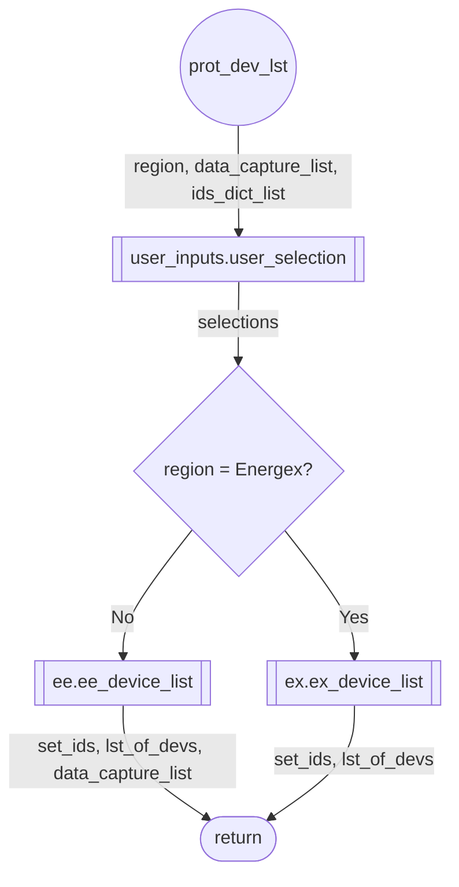

```mermaid
flowchart TD
A@{ shape: circle, label: "get_ips_settings" } --region, batch, called_function--> B
B[Create relay setting id dictionary]-- ids_dict_list --> C([Get selected devices from User])
C-- set_ids, device_list, data_capture_list --> D[[Get selected devices from User]]
D-- region, setting_ids --> E[[Query batch setting and CT data]]
E--device_list --> F[For device in device_list]
F--> G{Called function?}
G -->|No| H[Load CT settings in to deivce]
G -->|Yes| I[Load ips_settings in to deivce]
I --> H
H -- device_list --> J([return])
E -- ips_it_settings --> H
E -- ips_settings --> I
D -- data_capture_list --> J([return])
```

```mermaid
flowchart TD
A@{ shape: circle, label: "get_selected_devices" } --region, data_capture_list, ids_dict_list, called_function--> B
B{Called function?}
B -->|No| C[[Update selected existing devices in PowerFactory]]
B -->|Yes| D{region = Energex?}
D -->|No| E[[add_protection_relay_skeletons]]
D -->|Yes| F[[ex.create_new_devices]]
E -->G[[ee.ergon_all_dev_list]]
C -- set_ids, lst_of_devs, data_capture_list --> I([return])
F -- lst_of_devs, failed_cbs, set_ids --> I([return])
G -- set_ids, lst_of_devs, data_capture_list --> I([return])
```

```mermaid
flowchart TD
A@{ shape: circle, label: "prot_dev_lst" } --region, data_capture_list, ids_dict_list--> B
B[[user_inputs.user_selection]] -- selections --> C{region = Energex?}
C -->|No| D[[ee.ee_device_list]]
C -->|Yes| E[[ex.ex_device_list]]
D -- set_ids, lst_of_devs, data_capture_list --> F([return])
E -- set_ids, lst_of_devs --> F([return])
```

